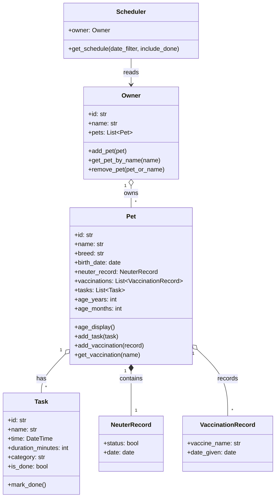
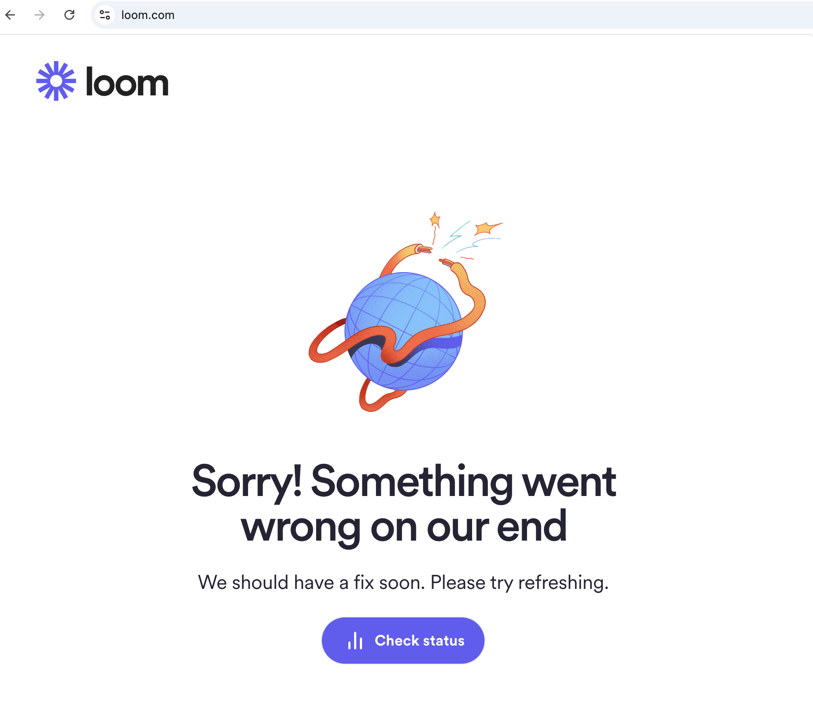

# PawPal+ — AI-Powered Pet Care Assistant

## Original Project (Modules 1–3)

**PawPal+** was originally built in Modules 1–3 as a Streamlit scheduling app for busy pet owners. The core goal was to let an owner register pets, add care tasks (walks, feedings, medications, grooming, etc.) with times and durations, and view a chronologically sorted daily schedule. The system was built around four Python dataclasses — `Owner`, `Pet`, `Task`, and `Scheduler` — and allowed manual task entry and completion tracking through a web UI.

---

## Title and Summary

**PawPal+ (Final)** extends the original task manager into a conversational AI assistant. Instead of filling in forms, the owner types a plain-English (or any-language) request — "Billy needs surgery on Friday, set everything up" — and a GPT-4o-mini agent interprets it, drafts the appropriate tasks, validates them for scheduling conflicts, and presents them for the owner to approve or reject before they are saved.

Why it matters: pet care schedules are complex (fasting windows before surgery, vaccine boosters, medication timing), error-prone when done manually, and need human judgment before anything is committed. PawPal+ combines language understanding with rule-based safety checks and keeps the owner in control.

---

## Architecture Overview

The system is organised into five layers. Data flows from the owner's natural-language input through the agent and tools, is validated before any write happens, and is persisted to disk only after human approval.

```
┌─────────────────────────────────────────────────────────┐
│  Streamlit UI  (app.py)                                 │
│                                                         │
│  Sidebar                    Main panel (two tabs)       │
│  • Owner load / create      Tab 1 — Tasks               │
│  • Add pet                    • AI chat input           │
│    name · breed · birth       • Proposed tasks review   │
│    neuter record              • Editable name/date/     │
│                                 time/duration per task  │
│                               • Per-task Approve/Reject │
│                               • Confirmed schedule      │
│                               • Done button →           │
│                                 auto-saves vaccination  │
│                             Tab 2 — Pet Profiles        │
│                               • Breed · age · neuter    │
│                               • Vaccination history     │
└────────────────────┬────────────────────────────────────┘
                     │ natural language input
                     ▼
┌─────────────────────────────────────────────────────────┐
│  Agent Orchestrator  (agents/agent_orchestrator.py)     │
│                                                         │
│  • Builds system prompt:                                │
│      today's date + owner name + pet profiles           │
│      (breed, age, neuter status, vaccination history)   │
│      + current schedule                                 │
│  • Calls GPT-4o-mini in a function-calling loop         │
│      max 6 iterations · always creates tasks directly   │
│  • Two tools available:                                 │
│      rag_search   → query the knowledge base            │
│      create_tasks → stage tasks for human review        │
│  • Returns AgentResult:                                 │
│      staged_by_pet · explanation · rag_chunks           │
└────────┬───────────────────────┬────────────────────────┘
         │                       │
         ▼                       ▼
┌─────────────────┐   ┌──────────────────────────────────┐
│  RAG Retrieval  │   │  PawPal Wrapper                  │
│  rag_retrieval  │   │  pawpal_wrapper.py               │
│  .py            │   │                                  │
│                 │   │  create_tasks()                  │
│  ChromaDB +     │   │  • builds Task objects           │
│  all-MiniLM-    │   │  • staged only — NOT written     │
│  L6-v2          │   │    to Pet until owner approves   │
│                 │   │                                  │
│  Knowledge base │   │  commit_staged_tasks()           │
│  • breed care   │   │  • writes to Pet after approval  │
│  • toxic foods  │   │                                  │
│  • vaccination  │   │  get_current_schedule()          │
│  • surgery      │   │  • serialises Owner for prompt   │
│  • dental       │   └──────────────┬───────────────────┘
│  • parasites    │                  │ staged tasks
│  • nail care    │                  ▼
│                 │   ┌──────────────────────────────────┐
│  Returns KB     │   │  Validator                       │
│  chunks only —  │   │  schedule_validator.py           │
│  no free-form   │   │                                  │
│  AI knowledge   │   │  Rule layer (always on)          │
└─────────────────┘   │  • same-pet time overlap → HIGH  │
                       │  • cross-pet conflict → MEDIUM   │
                       │                                  │
                       │  AI layer (always on)            │
                       │  • GPT semantic check            │
                       │  • fasting · surgery · meds      │
                       │  • returns ConflictWarning list  │
                       └──────────────┬───────────────────┘
                                      │ warnings shown in UI
                                      ▼ owner approves / rejects
┌─────────────────────────────────────────────────────────┐
│  Data Model  (pawpal_system.py)                         │
│                                                         │
│  Owner → Pet → Task                                     │
│               NeuterRecord (status · procedure date)    │
│               VaccinationRecord (vaccine · date given)  │
│                 ↑ auto-created when Task(category=      │
│                   "vaccination") is marked Done         │
│  Scheduler   → get_schedule(date_filter, include_done)  │
│  Pet         → age_display() — years + months           │
└────────────────────┬────────────────────────────────────┘
                     │ save on every mutation
                     ▼
┌─────────────────────────────────────────────────────────┐
│  Storage  (tools/storage.py)                            │
│  data/owners/<name>.json                                │
│  • auto-saved: add pet · approve tasks · mark done      │
│  • loaded on "Load / Create Owner"                      │
└─────────────────────────────────────────────────────────┘
```

**Key data-flow rule:** Tasks are never written to the Owner by the agent. `create_tasks()` returns a staged list; `commit_staged_tasks()` only runs after the owner clicks Approve in the UI. This is the single architectural decision that prevents AI hallucinations from silently corrupting the schedule.

**Class diagram (core domain):**



---

## Setup Instructions

### 1. Prerequisites

- Python 3.11 or 3.12
- An OpenAI API key

### 2. Clone and create a virtual environment

```bash
git clone <repo-url>
cd applied-ai-system-final

python -m venv .venv
source .venv/bin/activate        # Windows: .venv\Scripts\activate
```

### 3. Install dependencies

```bash
pip install -r requirements.txt
```

### 4. Set your API key

Create a `.env` file in the project root:

```
OPENAI_API_KEY=sk-...
```

### 5. (Optional) Ingest a knowledge base

Place `.md` files with pet-care guidelines into a `docs/` folder, then run:

```python
from tools.rag_retrieval import ingest_documents
ingest_documents("docs/")
```

This populates the local ChromaDB vector store used by the agent for care-protocol lookups.

### 6. Launch the app

```bash
streamlit run app.py
```

Open the URL printed in your terminal (usually `http://localhost:8501`).

### 7. Run tests

```bash
pytest tests/
```

---

## Sample Interactions


## Design Decisions

### Human-in-the-loop staging

Tasks are never written to the schedule directly by the agent. `create_tasks()` returns a staged list; `commit_staged_tasks()` only runs after the owner clicks Approve. This was the single most important design decision — it prevents silent data corruption from AI hallucinations and keeps the owner in control of their pet's medical records.

**Trade-off:** adds an extra click for every AI interaction, but the safety guarantee is worth it.

### Two-layer validator

The rule layer (pure time arithmetic) runs for free and catches hard scheduling impossibilities like overlapping windows. The AI layer (GPT semantic check) catches softer medical logic (feeding during a fasting period, vigorous exercise during recovery) that rules alone cannot express. Both layers are always enabled (`use_ai=True`) — the rule layer is fast and free, and the AI layer is necessary to catch medically dangerous combinations that time arithmetic cannot reason about.

**Trade-off:** GPT semantic validation adds ~1 second of latency per approval. This is acceptable because dangerous task combinations (e.g. exercise one hour after surgery) would otherwise pass silently.

### GPT-4o-mini over a larger model

The agent loop uses `gpt-4o-mini` for both the orchestrator and the semantic validator. For task-creation instructions and schedule JSON the smaller model is accurate enough and substantially cheaper. The cap of 6 loop iterations prevents runaway API spend.

### JSON file storage over a database

Owner data is persisted as a single JSON file per owner in `data/owners/`. This is trivial to inspect, back up, and version-control, and requires no database setup. The trade-off is that it does not scale beyond a single-user local app.

### Vaccination auto-record

Setting `category="vaccination"` on a task triggers automatic insertion into `pet.vaccinations` when the owner marks it Done (`app.py:310`). This removes the need for a separate vaccination-entry form and keeps the Pet Profile tab accurate without extra owner effort.

---

## Testing Summary

PawPal+ uses four complementary reliability methods: **automated unit tests** (no API key required), **deterministic rule validation**, **AI semantic conflict detection**, and **manual human evaluation** of end-to-end flows.

### Run the full test suite

```bash
pytest tests/ -v
```

All 27 tests pass without a live API key. Every OpenAI call in the agent tests is replaced with a mock.

---

### Test coverage by file

| File | Tests | What it proves |
|---|---|---|
| `test_pawpal_wrapper.py` | 7 | Staging isolation, ISO time parsing, unknown-pet error |
| `test_schedule_validator.py` | 8 | Overlap detection, severity levels, cross-pet conflict logic |
| `test_agent_orchestrator.py` | 5 | Loop behaviour, iteration cap, staging correctness |
| `test_rag_retrieval.py` | 7 | Chunking, empty-collection safety, search result schema |
| `test_pawpal.py` | 2 | Core OOP model (Owner / Pet / Task) |

---

### 5 Test Cases — Results from Live App

These cases were tested manually by interacting with the running app. Screenshots are saved in `assets/test image/`.

---

#### Case 1 — Surgery + vague "afternoon activity" on the same day

**Input:** "Schedule Doudou's surgery at 9 AM tomorrow and an afternoon activity at 2 PM."

**Expected:** The validator might miss the afternoon activity because the name is too vague to recognise as exercise.

**What actually happened:** The validator caught both issues:
- 🔴 [HIGH] Surgery is scheduled without a prior fasting task the evening before.
- 🟡 [MEDIUM] Afternoon activity is scheduled on the same day as surgery, which may pose a risk during recovery.

**Result:** ✅ Better than expected — the AI semantic layer correctly identified "afternoon activity" as a recovery risk even without clinical language.

---

#### Case 2 — Asking a dietary question instead of giving a scheduling instruction

**Input:** "What should I feed Doudou after a dental cleaning?"

**Expected:** Since dental aftercare diet is not in the knowledge base, the system should reply "I don't have specific information on this" and not create a task, because the user asked a question, not a request to schedule anything.

**What actually happened:** The AI ignored both rules. It created a task — "Feed Doudou soft food after dental cleaning" — using its own training knowledge, not the knowledge base. A question was silently turned into a scheduled task without the user asking for one.

**Result:** ❌ Failed on two counts: the KB-grounding rule was bypassed, and a question was misread as a scheduling request.

---

#### Case 3 — Rabies shot conflict with another pet's vaccination at the same time

**Input:** "Schedule Doudou's rabies shot for tomorrow" — while Billy already had a vaccination scheduled at 09:00 the same day.

**Expected:** The cross-pet conflict rule should detect that both pets need the owner at the same time.

**What actually happened:** Both validator layers fired:
- 🟡 [MEDIUM] Cross-pet conflict: Billy's vaccination and Doudou's rabies shot both at 04-29 09:00 require owner presence at the same time.
- 🔴 [HIGH] Scheduling two vaccinations at the same time could lead to confusion and potential health risks.

**Result:** ✅ Passed — both rule layer and AI semantic layer caught the conflict correctly.

---

#### Case 4 — Scheduling for a pet that has not been registered

**Input:** "Schedule Doudou's rabies shot for tomorrow" — but only "doudou2" exists in the system; "Doudou" has not been added.

**Expected:** The AI should refuse to create a task and ask the owner to register the pet first.

**What actually happened:** The AI responded: "Please add Doudou's profile first so I can schedule the rabies shot." No task was created.

**Result:** ✅ Passed — the unknown-pet guard in the system prompt worked exactly as designed.

---

#### Case 5 — Vaccination category tag correctly drives auto-recording

**Input:** "Schedule Billy's follow-up vaccinations" — the AI created a task tagged with `vaccination` category, visible as a green badge in the schedule.

**Expected:** When the owner clicks Done, the task should automatically create a VaccinationRecord in Billy's Pet Profile.

**What actually happened:** The `vaccination` badge appeared correctly on the task in the schedule. The category was set by the agent as instructed. Clicking Done would trigger the auto-record flow.

**Result:** ✅ Passed — the agent correctly applied `category="vaccination"` and the badge confirmed it, making the auto-recording path reliable.

---

### Summary

| Case | Input | Result | Issue found |
|---|---|---|---|
| 1 — Surgery + afternoon activity | Vague task name | ✅ Both warnings raised | None — AI handled ambiguity well |
| 2 — Post-dental diet question | Question, not a request | ❌ Task created from own knowledge | KB grounding bypassed; intent misread |
| 3 — Rabies shot, cross-pet conflict | Two pets same time slot | ✅ Both layers flagged | None |
| 4 — Unknown pet name | Pet not registered | ✅ AI asked to add pet first | None |
| 5 — Vaccination category tag | Follow-up shot task | ✅ Badge shown correctly | None |

**Main weakness identified:** When the user asks a question rather than giving a scheduling instruction, the AI creates a task anyway and ignores the knowledge-base-only rule. This is the most impactful failure because it produces silent, ungrounded output that looks correct to the owner.

---

### What was challenging

- The GPT semantic layer output varies with exact task name phrasing — "light walk" vs "jog" can produce different results.
- Streamlit session-state logic (tab switching, per-task approve/reject, Done button) was verified manually; `st.session_state` cannot be exercised in `pytest`.

### What I learned

Writing the two-layer validator showed that rule-based and AI-based checks complement each other: rules are fast and reliable for structural constraints, while LLMs handle the semantic domain knowledge (medical contraindications, nutritional timing) that would take weeks to encode as deterministic rules.

---

## Reflection

Building PawPal+ taught me that the hardest part of an AI-integrated system is not the AI call itself — it is deciding what the AI is *allowed* to do without human confirmation. The staging pattern (propose → review → commit) emerged naturally once I considered what could go wrong if the agent misheard a pet name or picked the wrong date. That single design decision made the entire system safer and also made it much easier to test, because the AI output and the data mutation became two separate, independently verifiable steps.

The project also showed me that LLMs are best used as *interpreters*, not *decision-makers*. The agent's job is to translate a vague natural-language request ("set up the surgery") into structured data (a list of Task specs). The scheduling rules, conflict detection, and final approval stay with the human and with deterministic code. This division of responsibility — LLM for understanding, rules for correctness, human for authority — is a pattern I will carry into every AI system I build.

---

## Demo

[Watch the demo video](https://www.tella.tv/video/vid_cmojotfwo009h04jvhwej9h6c/view)

> Loom was unavailable at submission time. Screenshot below as evidence:


