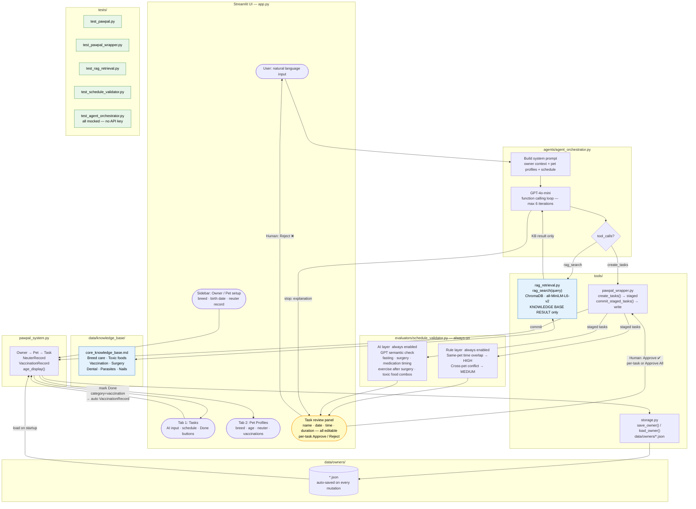

# PawPal+ System Architecture

> Copy the Mermaid code below into https://mermaid.live, export as PNG, and save as `assets/system_diagram.png`.

## Component Summary

| Component | File | Role |
|---|---|---|
| UI | `app.py` | Streamlit — sidebar setup, Tasks tab, Pet Profiles tab |
| Agent | `agents/agent_orchestrator.py` | GPT-4o-mini function calling loop, system prompt with RAG + task rules |
| RAG | `tools/rag_retrieval.py` | ChromaDB vector search — strictly constrains AI to KB content only |
| Knowledge Base | `data/knowledge_base/core_knowledge_base.md` | Breed care, toxic foods, vaccination, surgery, dental, parasites, nails |
| Wrapper | `tools/pawpal_wrapper.py` | Staging bridge — tasks only committed after human approval |
| Validator | `evaluators/schedule_validator.py` | Rule layer (time overlap) + AI layer (GPT semantic conflicts) — both always enabled |
| Storage | `tools/storage.py` | JSON persistence — auto-saved on every mutation |
| Data Model | `pawpal_system.py` | Owner / Pet / Task / NeuterRecord / VaccinationRecord |
| Tests | `tests/` | All agent tests mocked — no API key required for CI |
